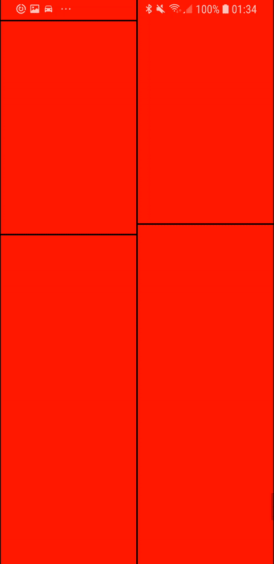

# react-native-masonry
A bare-bones  masonary layout for react-native.

<p align="center">
  
</p>

## 🚀 Getting Started
You can integrate with your project using [npm](https://www.npmjs.com/package/@cawfree/sofia):
```
npm install --save @cawfree/react-native-masonry
```
Alternatively, you can use [yarn](https://www.npmjs.com/package/@cawfree/sofia):
```
yarn add @cawfree/react-native-masonry
```

## ✏️ Example
In this example, we animate an infinite number of red boxes... but in your application, you can place and animate whatever and however you want. :)

```javascript
import React  from 'react';
import {
  Animated,
  View,
  StyleSheet,
  ScrollView,
} from 'react-native';
import PropTypes from 'prop-types';

import Masonry from '@cawfree/react-native-masonry';

const styles = StyleSheet.create({
  masonry: {
    flex: 1,
    backgroundColor: 'blue',
  },
});

export default class App extends React.Component {
  constructor(nextProps) {
    super(nextProps);
    this.state = ({
      fetching: false,
      // XXX: Initialize the layout with some values.
      items: [
        { key: `${Math.random()}`, opacity: new Animated.Value(0) },
        { key: `${Math.random()}`, opacity: new Animated.Value(0) },
        { key: `${Math.random()}`, opacity: new Animated.Value(0) },
        { key: `${Math.random()}`, opacity: new Animated.Value(0) },
        { key: `${Math.random()}`, opacity: new Animated.Value(0) },
        { key: `${Math.random()}`, opacity: new Animated.Value(0) },
        { key: `${Math.random()}`, opacity: new Animated.Value(0) },
        { key: `${Math.random()}`, opacity: new Animated.Value(0) },
      ],
    });
    this.__renderItem = this.__renderItem.bind(this);
    this.__onScroll = this.__onScroll.bind(this);
  }
  // XXX: Render anything you want!
  __renderItem(item) {
    const height = (item.key * 500) + 100;
    const {
      opacity,
    } = item;
    return (
      <Animated.View
        style={{
          flex: 1,
          borderWidth: 1,
          height,
          backgroundColor: 'red',
          opacity,
        }}
      />
    );
  }
  // XXX: Callback from Masonry when a brick has been placed.
  __onItemPlaced(item) {
    const {
      opacity,
    } = item;
    Animated.timing(
      opacity,
      {
        toValue: 1,
        duration: 1000,
        useNativeDriver: true,
      },
    )
      .start();
  }
  __onScroll(e) {
    const {
      layoutMeasurement,
      contentOffset,
      contentSize,
    } = e.nativeEvent;
    const {
      onEndReachedThreshold,
    } = this.props;
    const {
      fetching,
    } = this.state;
    const thresholdIsReached = (layoutMeasurement.height + contentOffset.y) >= (contentSize.height - onEndReachedThreshold);
    if (thresholdIsReached && !fetching) {
      this.setState({
        // XXX: Add some more items to the list!
        items: ([
          ...this.state.items,
          { key: `${Math.random()}`, opacity: new Animated.Value(0) },
          { key: `${Math.random()}`, opacity: new Animated.Value(0) },
          { key: `${Math.random()}`, opacity: new Animated.Value(0) },
          { key: `${Math.random()}`, opacity: new Animated.Value(0) },
          { key: `${Math.random()}`, opacity: new Animated.Value(0) },
          { key: `${Math.random()}`, opacity: new Animated.Value(0) },
          { key: `${Math.random()}`, opacity: new Animated.Value(0) },
          { key: `${Math.random()}`, opacity: new Animated.Value(0) },
        ]),
      });
    }
  }
  render() {
    const {
      items,
    } = this.state;
    return (
      <Masonry
        style={styles.masonry}
        items={items}
        renderItem={this.__renderItem}
        onItemPlaced={this.__onItemPlaced}
        ScrollComponent={ScrollView}
        useNativeDriver
        scrollEventThrottle={400}
        onScroll={this.__onScroll}
      />
    );
  }
}
```

## ✌️ License
[MIT](https://opensource.org/licenses/MIT)
